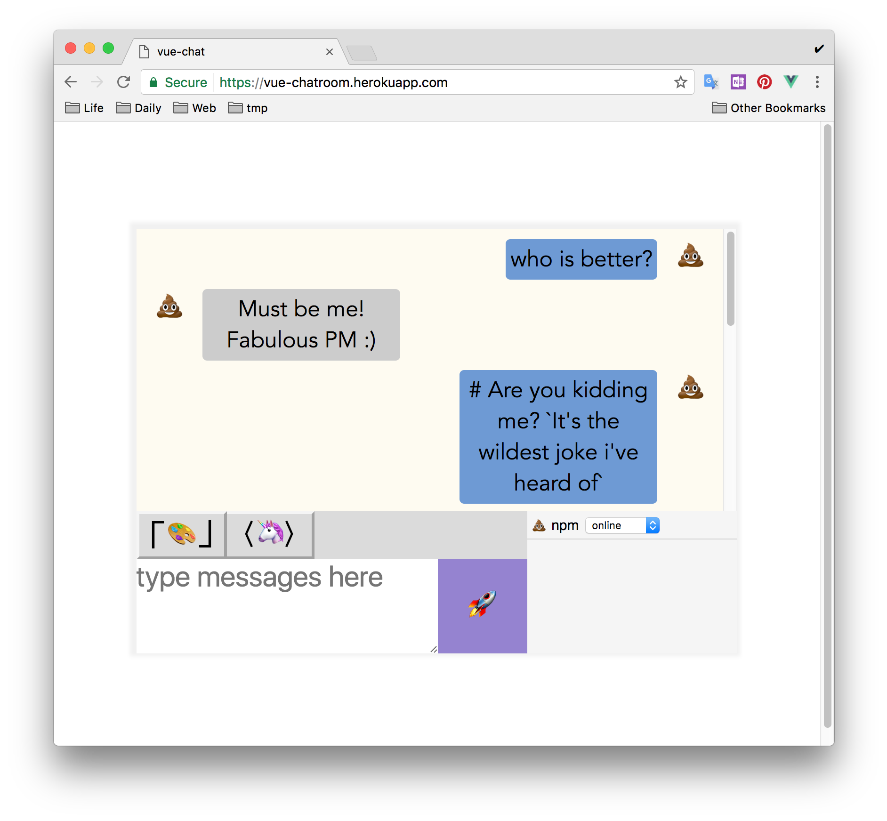

# vue-chat

> A Vue.js project, yet a simple start up app for vuex and socket.io

## Build Setup

``` bash
# install dependencies
npm install

# serve with hot reload at localhost:8080
npm run dev

# build for production with minification
npm run build
```

## Preview



## Features

- Emoji as avatar
- Markdown support for text editing
- Real-time(socket.io) user action broadcasting
